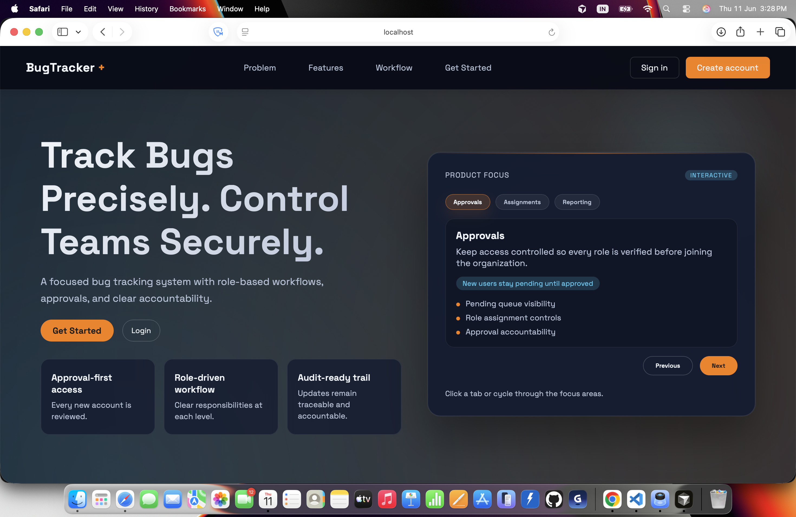
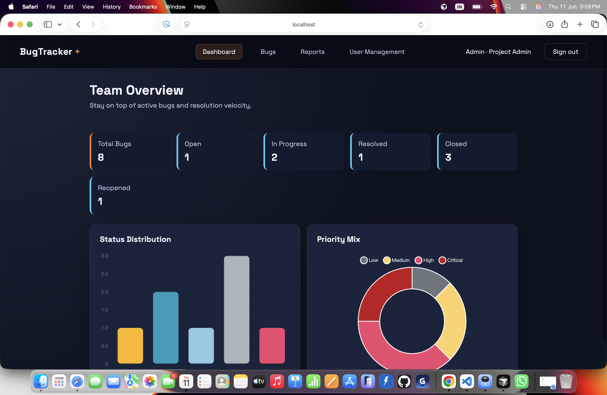
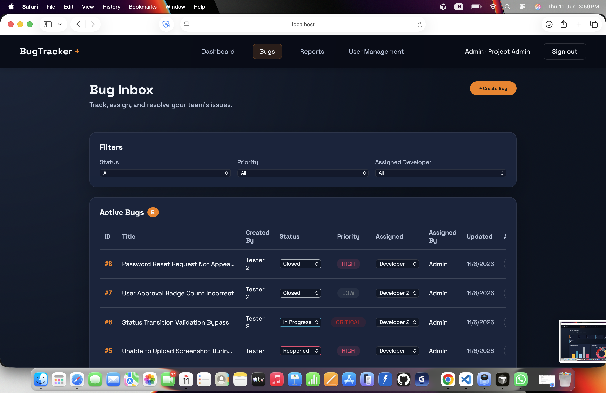
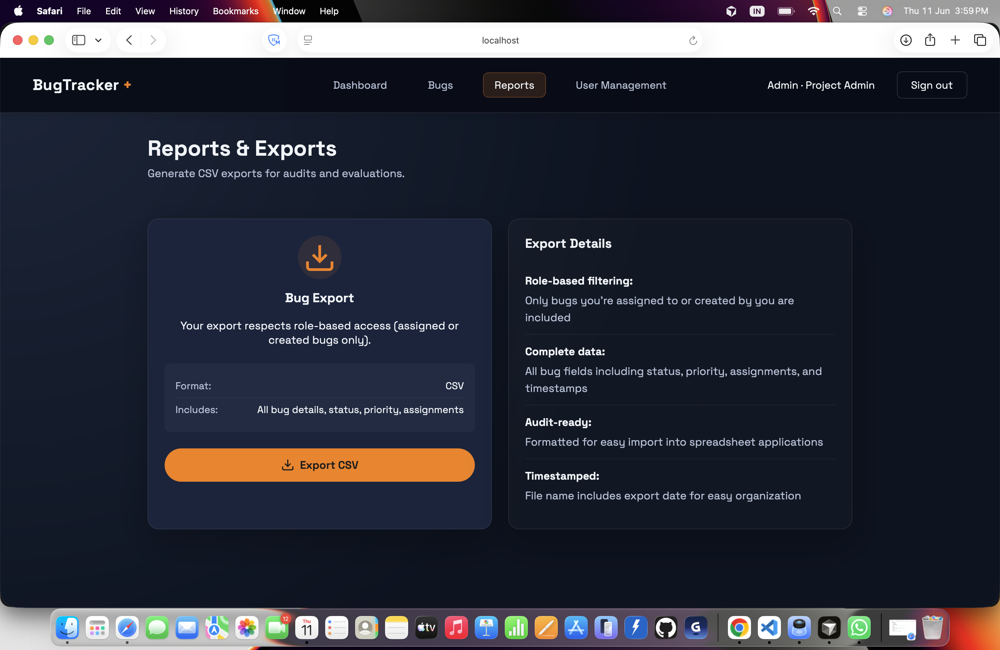
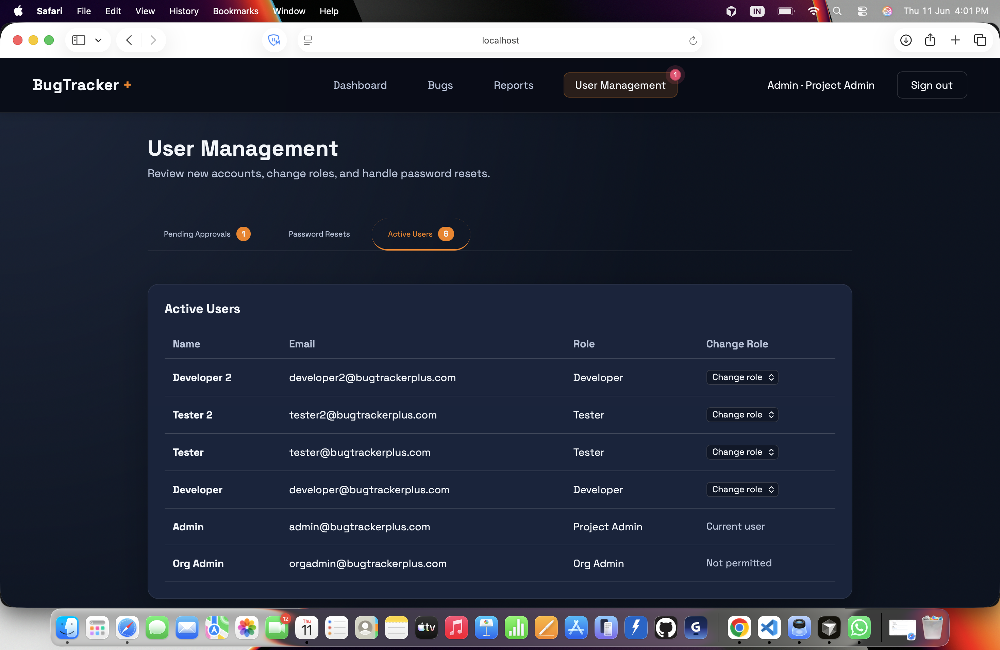

<h1 align="center">🐞 BugTracker+</h1>

<p align="center">
  <strong>Track Bugs. Collaborate Efficiently. Deliver Quality Software.</strong>
</p>

<p align="center">
  A Dockerized Three-Tier Bug Tracking Platform with Role-Based Access Control,
  Analytics, and Automated Cloud Deployment.
</p>

<p align="center">
  
</p>

<p align="center">
  
  
  
  
  
  
  
</p>

<p align="center">
  <strong>React</strong> •
  <strong>Node.js</strong> •
  <strong>MySQL</strong> •
  <strong>Docker</strong> •
  <strong>AWS EC2</strong> •
  <strong>GitHub Actions</strong>
</p>

---

## 🚀 Overview

BugTracker+ is a production-ready bug tracking platform built to streamline software defect management across development teams.

The application enables users to create, assign, track, resolve, verify, and report bugs through a structured workflow backed by secure authentication, role-based access control, dashboard analytics, and cloud-native deployment practices.

The platform follows a **Dockerized Three-Tier Architecture** and is deployed on **AWS EC2** through an automated **GitHub Actions CI/CD Pipeline**.

---

## ✨ Highlights

- 🏛️ Dockerized Three-Tier Architecture
- 🔐 JWT Authentication & Role-Based Access Control (RBAC)
- 🐛 Complete Bug Lifecycle Management
- 📊 Dashboard Analytics & Reporting
- 👥 User Approval Workflow
- 📈 CSV Export & Audit Reporting
- 🚀 GitHub Actions CI/CD Pipeline
- ☁️ AWS EC2 Deployment
- 🐳 Docker & Docker Compose Orchestration
- 🔒 Secure API Architecture

---

# 📸 Application Preview

## Landing Page

The public-facing landing page introduces the platform and highlights key features.



---

## Dashboard Analytics

Track bug resolution progress through real-time metrics, status distribution charts, and priority analysis.



---

## Bug Management

Create, assign, filter, track, and manage bugs through a centralized workflow dashboard.



---

## Reports & CSV Export

Generate audit-ready CSV reports with role-based access controls.



---

## User Management & RBAC

Manage user approvals, role assignments, password reset requests, and organization-level access controls.



---

# 🏛️ Three-Tier Architecture

BugTracker+ follows a modern Three-Tier Architecture to ensure scalability, maintainability, and separation of concerns.

## Presentation Tier

**Technologies**

- React 18
- Vite
- Nginx

**Responsibilities**

- User Interface Rendering
- API Communication
- Client-Side Routing

---

## Application Tier

**Technologies**

- Node.js
- Express.js

**Responsibilities**

- Authentication & Authorization
- Business Logic
- Bug Management
- Reporting
- REST APIs

---

## Data Tier

**Technology**

- MySQL 8

**Responsibilities**

- User Data Storage
- Bug Storage
- Comments & Assignments
- Reporting Data

---

## Architecture Diagram

```text
                    Internet
                        │
                        ▼
        ┌────────────────────────────┐
        │ Frontend Container         │
        │ React + Vite + Nginx       │
        └─────────────┬──────────────┘
                      │
                      ▼
        ┌────────────────────────────┐
        │ Backend Container          │
        │ Node.js + Express API      │
        └─────────────┬──────────────┘
                      │
                      ▼
        ┌────────────────────────────┐
        │ Database Container         │
        │ MySQL 8                    │
        └────────────────────────────┘
```

All services are containerized using Docker and orchestrated with Docker Compose on AWS EC2.

---

# 🔄 Bug Lifecycle Workflow

```text
Open
 │
 ▼
In Progress
 │
 ▼
Resolved
 │
 ├──────► Closed
 │
 ▼
Reopened
 │
 ▼
In Progress
```

---

# 👥 Role-Based Access Control

| Role | Responsibilities |
|--------|----------------|
| Org Admin | Full system administration |
| Project Admin | User management and bug assignment |
| Developer | Resolve assigned bugs |
| Tester | Create and verify bugs |

---

# 🛠️ Technology Stack

### Frontend

- React 18
- Vite
- React Router DOM
- Axios
- Chart.js
- CSS

### Backend

- Node.js
- Express.js
- JWT Authentication
- bcrypt
- express-validator
- mysql2

### Database

- MySQL 8

### DevOps & Cloud

- Docker
- Docker Compose
- GitHub Actions
- AWS EC2
- Nginx

---

# 📂 Project Structure

```bash
BugTracker-plus/
│
├── assets/
│   └── banner.png
│
├── screenshots/
│   ├── landing-page.png
│   ├── dashboard-overview.png
│   ├── bug-management.png
│   ├── reports-export.png
│   └── user-management.png
│
├── client/
├── server/
├── docker-compose.yml
├── package.json
└── README.md
```

---

# 🔐 Security Features

- JWT Authentication
- bcrypt Password Hashing
- Role-Based Authorization
- Protected Routes
- Request Validation
- Rate Limiting
- Helmet Security Headers
- Soft Delete Architecture

---

# 🚀 Running Locally

## Clone Repository

```bash
git clone https://github.com/dhxruv999/BugTracker-plus.git

cd BugTracker-plus
```

## Start Application

```bash
docker-compose up -d --build
```

## Access Application

```text
Frontend : http://localhost:8000

Backend  : http://localhost:4000
```

---

# 🚀 CI/CD Pipeline

```text
Developer Push
      │
      ▼
GitHub Repository
      │
      ▼
GitHub Actions
      │
      ▼
Build Docker Images
      │
      ▼
Push Images to Docker Hub
      │
      ▼
Deploy to AWS EC2
      │
      ▼
Docker Compose Update
      │
      ▼
Health Check Validation
```

---

# 📚 Key Learning Outcomes

- Full Stack Development
- Three-Tier Architecture
- REST API Design
- Authentication & Authorization
- Database Design
- Docker Containerization
- Docker Compose Orchestration
- GitHub Actions CI/CD
- AWS EC2 Deployment
- Nginx Reverse Proxy Configuration
- Production Security Practices

---

# 👨‍💻 Author

### Dhruv Maheshwari

**B.Tech AWS Student | Full Stack Developer | Cloud & DevOps Enthusiast**

- GitHub: https://github.com/dhxruv999

---

## ⭐ Support

If you found this project useful, consider giving it a star ⭐ on GitHub.
