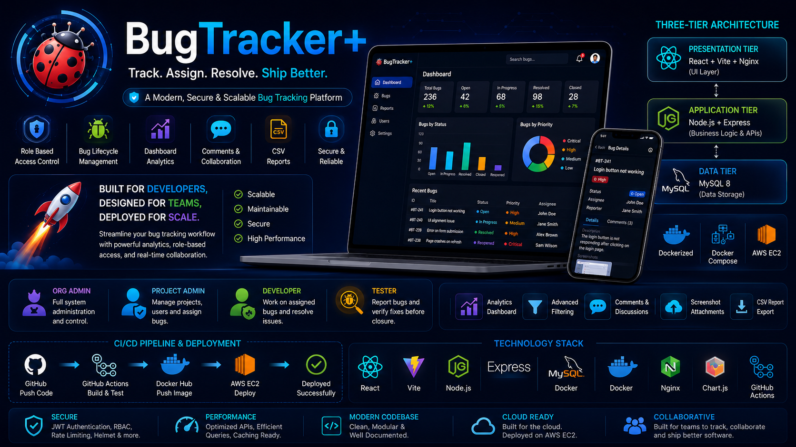

# 🐞 BugTracker+

<p align="center">
  
</p>

<p align="center">
  <strong>A Dockerized Three-Tier Bug Tracking Platform with Role-Based Access Control, Analytics, and Automated AWS Deployment.</strong>
</p>

<p align="center">
  
  
  
  
  
  
  
</p>

---

## 📸 Application Preview

### Dashboard Analytics

<p align="center">
  
</p>

### Bug Management

<p align="center">
  
</p>

### User Administration

<p align="center">
  
</p>

---

# 🚀 Overview

BugTracker+ is a production-ready bug tracking platform designed to streamline software defect management across development teams.

The platform enables users to create, assign, track, resolve, verify, and report bugs through a structured workflow backed by secure authentication, role-based access control, dashboard analytics, and cloud-native deployment practices.

The application follows a **Dockerized Three-Tier Architecture** and is deployed on **AWS EC2** through an automated **GitHub Actions CI/CD Pipeline**.

---

# 🏛️ Three-Tier Architecture

BugTracker+ is built using a modern **Three-Tier Architecture**, ensuring scalability, maintainability, and separation of concerns.

### Presentation Tier

- React 18
- Vite
- Nginx

Responsible for rendering the user interface and communicating with backend APIs.

### Application Tier

- Node.js
- Express.js

Handles:

- Authentication
- Authorization
- Bug Management
- Reporting
- Business Logic
- API Services

### Data Tier

- MySQL 8

Responsible for persistent storage of:

- Users
- Bugs
- Comments
- Assignments
- Reports

### Deployment Architecture

```text
                     Internet
                         │
                         ▼
          ┌─────────────────────────┐
          │ Frontend Container      │
          │ React + Vite + Nginx    │
          └───────────┬─────────────┘
                      │
                      ▼
          ┌─────────────────────────┐
          │ Backend Container       │
          │ Node.js + Express       │
          └───────────┬─────────────┘
                      │
                      ▼
          ┌─────────────────────────┐
          │ Database Container      │
          │ MySQL 8                 │
          └─────────────────────────┘
```

All three tiers are containerized using Docker and orchestrated using Docker Compose on AWS EC2.

---

# ✨ Features

## 🔐 Authentication & Security

- JWT Authentication
- bcrypt Password Hashing
- Role-Based Access Control (RBAC)
- Protected Routes
- Request Validation
- Rate Limiting
- Helmet Security Headers
- Soft Deletes

---

## 👥 User Management

- User Registration
- User Approval Workflow
- Role Assignment
- User Status Management
- Password Reset Requests
- Hierarchical Administrative Controls

---

## 🐛 Bug Tracking System

- Create Bugs
- Assign Bugs
- Track Bug Status
- Manage Priorities
- Upload Screenshots
- Comment System
- Bug Filtering
- Search Functionality
- Soft Deletes

---

## 🔄 Bug Lifecycle Workflow

```text
Open
 │
 ▼
In Progress
 │
 ▼
Resolved
 │
 ├────────► Closed
 │
 ▼
Reopened
 │
 ▼
In Progress
```

### Status Permissions

| Role | Allowed Actions |
|--------|------------|
| Developer | Open → In Progress → Resolved |
| Tester | Resolved → Closed / Reopened |
| Admin | Any Status Transition |

---

## 📊 Analytics Dashboard

- Total Bugs Overview
- Status Distribution
- Priority Distribution
- Assignee Statistics
- Interactive Charts
- Filterable Insights

---

## 📈 Reporting

- CSV Export
- Role-Based Data Access
- Downloadable Reports
- Bug Analytics

---

## 🚀 DevOps Features

- Dockerized Application
- Multi-Container Architecture
- Docker Compose Orchestration
- GitHub Actions CI/CD
- AWS EC2 Deployment
- Nginx Reverse Proxy
- Automated Health Checks

---

# 👥 Role-Based Access Control

| Role | Responsibilities |
|--------|----------------|
| Org Admin | Full system administration |
| Project Admin | User management and bug assignment |
| Developer | Resolve assigned bugs |
| Tester | Create and verify bugs |

---

# 🛠️ Technology Stack

## Frontend

- React 18
- Vite
- React Router DOM
- Axios
- Chart.js
- CSS

## Backend

- Node.js
- Express.js
- JWT Authentication
- bcrypt
- express-validator
- mysql2

## Database

- MySQL 8

## DevOps & Cloud

- Docker
- Docker Compose
- GitHub Actions
- AWS EC2
- Nginx

---

# 📂 Project Structure

```bash
BugTracker-Plus/
│
├── client/
│   ├── src/
│   │   ├── pages/
│   │   ├── components/
│   │   ├── contexts/
│   │   ├── services/
│   │   └── styles/
│   │
│   ├── Dockerfile
│   └── nginx.conf
│
├── server/
│   ├── src/
│   │   ├── routes/
│   │   ├── controllers/
│   │   ├── models/
│   │   ├── middleware/
│   │   ├── validators/
│   │   └── config/
│   │
│   ├── database/
│   │   └── schema.sql
│   │
│   └── Dockerfile
│
├── docker-compose.yml
│
├── .github/
│   └── workflows/
│       └── CI-CD.yml
│
└── README.md
```

---

# 📡 API Modules

| Endpoint | Purpose |
|-----------|----------|
| /api/auth | Authentication & Authorization |
| /api/users | User Management |
| /api/bugs | Bug Operations |
| /api/dashboard | Dashboard Analytics |
| /api/reports | CSV Reporting |
| /api/public | Public Metrics |
| /health | Health Monitoring |

---

# 🚀 Running Locally

## Clone Repository

```bash
git clone https://github.com/dhxruv999/BugTracker-Plus.git

cd BugTracker-Plus
```

## Start Application

```bash
docker-compose up -d --build
```

## Access Application

```text
Frontend: http://localhost:8000

Backend: http://localhost:4000
```

---

# ⚙️ Environment Variables

## Backend

```env
PORT=4000

DB_HOST=
DB_PORT=
DB_USER=
DB_PASSWORD=
DB_NAME=

JWT_SECRET=
JWT_EXPIRES_IN=

CORS_ORIGIN=

ORG_ADMIN_RESET_PHRASE_HASH=
```

## Frontend

```env
VITE_API_URL=http://localhost:4000/api
```

---

# 🚀 CI/CD Pipeline

```text
Developer Push
      │
      ▼
GitHub Repository
      │
      ▼
GitHub Actions
      │
      ▼
Build Docker Images
      │
      ▼
Push Images to Docker Hub
      │
      ▼
SSH Into AWS EC2
      │
      ▼
Docker Compose Pull
      │
      ▼
Docker Compose Up
      │
      ▼
Health Check Validation
```

---

# 📚 Key Learning Outcomes

This project provided hands-on experience with:

- Full Stack Development
- Three-Tier Architecture
- REST API Design
- Authentication & Authorization
- Database Design
- Docker Containerization
- Docker Compose Orchestration
- GitHub Actions CI/CD
- AWS EC2 Deployment
- Nginx Reverse Proxy Configuration
- Production Security Practices

---

# 👨‍💻 Author

### Dhruv Maheshwari

**B.Tech AWS Student | Full Stack Developer | Cloud & DevOps Enthusiast**

- GitHub: https://github.com/dhxruv999
- LinkedIn: https://linkedin.com/in/YOUR_LINKEDIN

---

## ⭐ Support

If you found this project useful, consider giving it a star ⭐ on GitHub.

It helps others discover the project and motivates future improvements.
